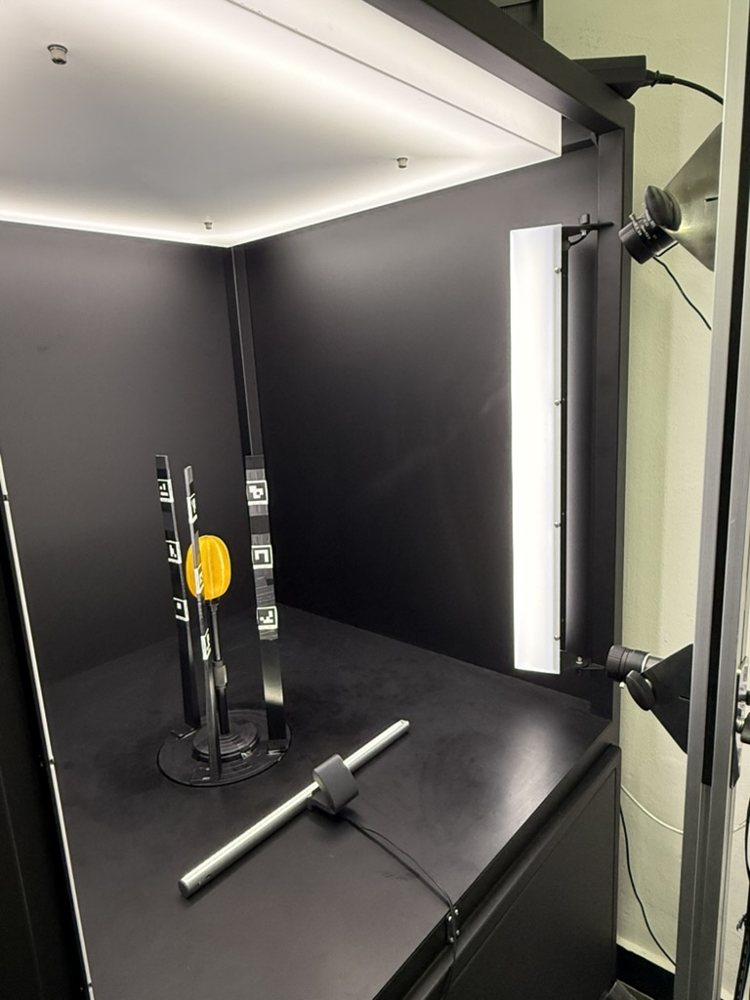

# Fruit 3D Reconstruction (ArUco-scaled COLMAP)

Multi-view 3D reconstruction pipeline for **fruit (e.g. Korean melon)** with automatic metric scale recovery via ArUco markers. From multi-view RGB + SAM3 object masks to a metric-scale point cloud (`fused_scaled.ply`, units: m) in a single pipeline.



> Originally extracted as the GROUND TRUTH stage (Step A) and SAM3 labeling step (Step 1) of the [`tcore` shape-completion dataset pipeline](https://github.com/sungjay-kim).

---

## Summary

| Item | Detail |
| --- | --- |
| Input | Multi-view RGB images (recommended: 3 cameras × 36 frames × 10° spacing) |
| Masks | SAM3 text-prompted binary masks |
| Camera poses | COLMAP SIFT + cross-camera angular pair matching |
| Dense | COLMAP PatchMatch Stereo + Stereo Fusion (multi-GPU supported) |
| Scale | ArUco markers (3 cm × 3 cm, `DICT_4X4_50`) auto-triangulated |
| Output | `fused_scaled.ply` (units: m, denoised) |

---

## Directory layout

```
fruit-3d-recon/
├── README.md
├── bash/
│   ├── aruco_reconstruction.sh       # Main pipeline
│   ├── manual_relaxed_crosscam.sh    # Sparse reconstruction (cross-cam matching)
│   ├── dense.sh                      # Dense reconstruction + mask filtering
│   └── pointcloud_to_mesh.sh         # (Optional) Poisson meshing
├── scripts/
│   ├── generate_aruco_markers.py     # Generate ArUco PDF
│   ├── generate_aruco_masks.py       # Auto-generate ArUco masks
│   ├── compute_aruco_scale.py        # Triangulate markers, compute scale factor
│   ├── apply_scale_to_ply.py         # Apply scale to fused.ply
│   ├── remove_noise_ply.py           # Denoise final point cloud
│   ├── copy_img_and_mask.py          # Stage RGB + masks into runs/ layout
│   ├── mesh_volume.py                # Mesh volume computation
│   └── preprocess_pointcloud_for_meshing.py
├── sam3_labeling/
│   └── run_text_prompt_on_zip.py     # SAM3 text-prompt labeling driver
├── aruco_markers/
│   └── aruco_markers_3cm_x24.pdf     # Print-ready (24 markers, 3 cm)
└── third_party/
    └── colmap_python/
        └── read_write_model.py        # COLMAP official helper (BSD-3)
```

---

## Dependencies

### 1. COLMAP

The `colmap` binary must be on `PATH`, or set the `COLMAP_BIN` environment variable.
A GPU build is recommended (PatchMatch Stereo uses CUDA).

```bash
# Ubuntu
sudo apt-get install colmap

# Or build from source: https://colmap.github.io/install.html
```

### 2. Python environment

Tested with Python 3.10+, micromamba/conda env named `colmap_env`:

```bash
micromamba create -n colmap_env -c conda-forge \
  python=3.10 colmap opencv open3d numpy pillow scipy
micromamba activate colmap_env
```

### 3. SAM3 (labeling step only)

[Meta SAM3](https://github.com/facebookresearch/sam3) is a separate dependency (used only for labeling — keep it in its own environment):

```bash
git clone https://github.com/facebookresearch/sam3.git
cd sam3
# Verified at the time of writing: main branch (Python 3.12+, PyTorch 2.7+)
pip install -e .
```

After installing SAM3, use this repo's `sam3_labeling/run_text_prompt_on_zip.py` (it imports the `sam3` package — copy into the SAM3 repo or add SAM3 to `PYTHONPATH`).

---

## Data preparation

### Expected layout

```
runs/{SAMPLE}/
├── images/
│   ├── 1/    # camera 1 frames (PNG)
│   ├── 2/    # camera 2 frames
│   └── 3/    # camera 3 frames
└── masks/    # SAM3 object masks (object only, no marker pixels)
    ├── 1/
    ├── 2/
    └── 3/
```

Image filenames must encode the rotation angle. Examples: `CAM#1_xxx(Degree-0).png`, `CAM#1_xxx(Degree-10).png`, ...

### ArUco marker rig (one-time setup)

1. `python scripts/generate_aruco_markers.py` → `aruco_markers/aruco_markers_3cm_x24.pdf` (already included).
2. Print and mount on 3–4 black vertical panels (each marker has a 0.3 cm white border for contrast).
3. Place panels around the turntable so they **rotate with the object**.

**Marker roles:**
- ① Aid feature matching / pose estimation in sparse reconstruction
- ② Compute the scale factor (known 0.03 m size → corrects COLMAP's arbitrary scale)

---

## Running the pipeline

### Step 1. SAM3 labeling

```bash
# In the SAM3 environment
python sam3_labeling/run_text_prompt_on_zip.py \
  --frames-path /path/to/{SAMPLE}_{CAM} \
  --prompt "melon" \
  --prompt-frame 0 \
  --output-dir /path/to/output_dir \
  --outputs masks overlays json \
  --direction both
```

Run once per `(SAMPLE, CAM)` combination (e.g. `20260318_test_1`, `20260318_test_2`, `20260318_test_3`).

Outputs:
- `output_dir/{SAMPLE}_{CAM}/masks/*.png` — binary mask (L mode, 0/255)
- `output_dir/{SAMPLE}_{CAM}/overlays/*.png` — visualizations
- `output_dir/{SAMPLE}_{CAM}/predictions.json` — metadata

### Step 2. Stage data

```bash
# In colmap_env
python scripts/copy_img_and_mask.py \
  --merged-root /path/to/phenobox/merged \
  --mask-root /path/to/sam3/output_dir \
  --runs-root ./runs
```

Copies each sample's images and masks into `runs/{SAMPLE}/images/{cam}/` and `runs/{SAMPLE}/masks/{cam}/`.

Source layout (example):
- `merged-root/{SAMPLE}/{1,2,3}/*.png` — per-camera RGB frames
- `mask-root/{SAMPLE}_{CAM}/masks/*_obj0.png` — SAM3 masks (or `mask-root/{SAMPLE}/{CAM}/masks/`)

### Step 3. ArUco-scaled reconstruction

```bash
# Default
bash bash/aruco_reconstruction.sh {SAMPLE}

# With cam2 brightness boost + relaxed angle delta + GPU pinning
bash bash/aruco_reconstruction.sh {SAMPLE} 1.5 25 0,1
```

**Parameters:**

| # | Variable | Default | Meaning |
| --- | --- | --- | --- |
| 1 | `SAMPLE` | — | Sample ID (must exist as `runs/{SAMPLE}/`) |
| 2 | `BRIGHT_FACTOR` | 1.0 | Brightness gain for camera 2 (>1.0 = brighter) |
| 3 | `ANGLE_DELTA` | 20 | Cross-camera matching angular threshold (deg) |
| 4 | `GPU_IDX` | 0,1 | GPU index list for PatchMatch |

**Internal flow:**

```
[1] Snapshot original masks/ → object_masks/
[2] generate_aruco_masks.py → aruco_masks/ + sparse_masks/
[3] masks/ ← sparse_masks/  (object + marker masks for sparse)
[4] Sparse reconstruction (manual_relaxed_crosscam.sh)
       SIFT features → sequential + cross-cam angular pair matching
       → COLMAP Mapper → sparse/manual_relaxed/{idx}/
[5] masks/ ← object_masks/  (object only, for dense)
[6] Auto-select best sparse model (most registered images)
[7] compute_aruco_scale.py → scale_factor.json (marker corner triangulation)
[8] dense.sh → fused.ply (mask-based filtering included)
[9] apply_scale_to_ply.py → fused_scaled.ply (units: m)
[10] remove_noise_ply.py → overwrites fused_scaled.ply with denoised version
```

**Outputs:**

| File | Content |
| --- | --- |
| `runs/{SAMPLE}/dense/manual_relaxed_{idx}/fused.ply` | Dense PCD (COLMAP arbitrary scale) |
| `runs/{SAMPLE}/dense/manual_relaxed_{idx}/fused_scaled.ply` | **Final output** — units: m, denoised |
| `runs/{SAMPLE}/scale_factor.json` | scale factor + triangulation stats |
| `runs/{SAMPLE}/aruco_masks/`, `sparse_masks/` | auto-generated masks |

### Step 4. (Optional) Meshing

```bash
bash bash/pointcloud_to_mesh.sh {SAMPLE}
```

Runs Poisson surface reconstruction on `fused.ply`.

Tunable via env vars:
- `COLMAP_BIN` — path to `colmap` binary (default: `colmap` on `PATH`)
- `POISSON_DEPTH` (default 9) — try 10–11 if quality is insufficient
- `RUN_DELAUNAY=1` — also run the Delaunay mesher

---

## Reference timing

`20260318_test` (3 cameras × 36 frames = 108 images, A6000 × 2 GPUs):

| Stage | Time |
| --- | --- |
| ArUco mask generation | ~2 min |
| Sparse reconstruction | ~4 min |
| Scale factor computation | ~16 s |
| Dense reconstruction (2 GPUs) | ~19 min |
| **Total** | **~26 min** |

- Scale factor: 0.205792 m / COLMAP_unit (averaged over ≥3 markers)
- Result size: 0.142 × 0.130 × 0.129 m (single melon)

---

## Troubleshooting

| Symptom | Action |
| --- | --- |
| Camera 2 too dark to register | Set `BRIGHT_FACTOR=1.5` or `2.0` |
| Cross-cam matching fails | Relax with `ANGLE_DELTA=25–30` |
| Less than 50% of images registered | `manual_relaxed_crosscam.sh` automatically falls back to exhaustive matcher with more aggressive settings |
| ArUco markers undetected | Detection uses a union of preprocessing variants (CLAHE, gamma, blue channel). Valid marker pixel range: 50–250 px. If the camera is too far, increase printed marker size. |
| Poisson mesh too rough | Bump `POISSON_DEPTH=10` or `11` |

---

## License

- This repo's code: [MIT](LICENSE)
- `third_party/colmap_python/read_write_model.py`: COLMAP project (BSD-3)
- SAM3 has its own license (Meta) — not bundled here, install separately
